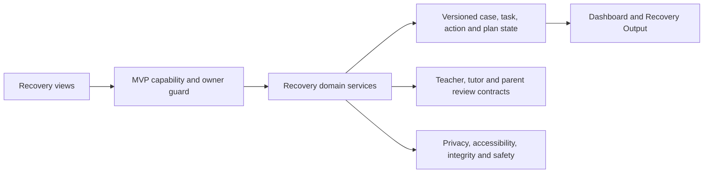
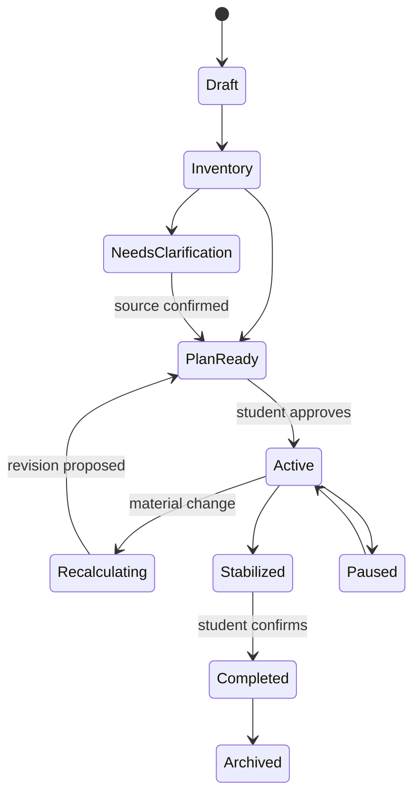
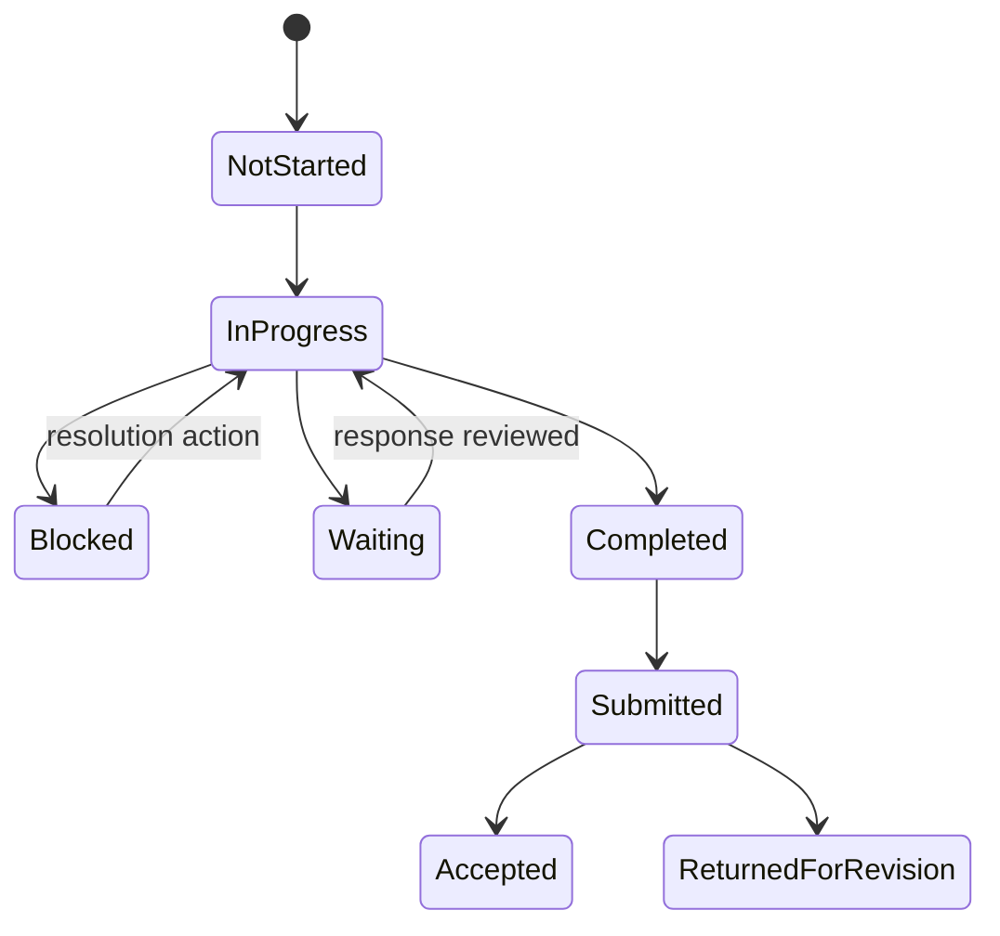

# I’m Behind — Academic Recovery Mode: Implementation Blueprint

## Existing codebase review

StudySpark is a vanilla HTML/CSS/JavaScript single-page prototype. Feature modules attach to `index (2).html`, expose frozen browser/CommonJS APIs and store demo state in memory or browser storage. Tests use Node's built-in `assert`. There is no framework, database, ORM, migration runner, trusted authentication/authorization provider, server API, package manifest, production notification/analytics service, service worker, CI or production build.

Existing reusable systems include demo student/role records, courses and assignments; Academic Recovery entry/work/capacity/verification/priority/plan/action/check-in services; AI Coach rule contracts; supportive notification preferences; Verified Peer Tutoring and teacher support; accessibility preferences, Language Bridge, TTS/STT contracts, Low-Bandwidth and offline-package contracts; privacy serializers/audits; the shared dashboard/design tokens; and deterministic test suites. The Recovery MVP controller gates these existing modules instead of replacing them.

Capability status: feature/domain contracts and automated fixtures are broadly implemented; authenticated server enforcement, database durability/migrations, live approved imports, real message delivery, production AI/providers, cross-device offline sync and manual assistive-technology evidence remain unavailable. No production release is claimed.

## Recovery user journey

1. Open **Help Me Catch Up** from an approved student context.
2. Choose Quick Rescue (24 hours) or Full Recovery (seven days), then one or more situation modes.
3. Add or confirm tasks and uncertain source facts.
4. Enter realistic time, commitments, breaks and preferences.
5. Review workload feasibility and teacher decisions.
6. Review Do Now, Ask First, Do Next, Schedule Later and authority-gated Consider Releasing explanations.
7. Repair only prerequisites needed for current work.
8. Approve Minimum/optional Stretch and seven-day actions.
9. Start one observable action or ten-minute focus.
10. Check in briefly; preserve partial progress and recalculate only after review.
11. Intentionally draft/share minimum teacher, tutor or parent support when authorized.
12. Recognize source-grounded progress and finish/pause without penalty.

At every step, immediate-safety flow supersedes academic planning and routes to authorized human support.

## Proposed architecture

The existing modular monolith remains the prototype architecture:

Production evolution should keep these domain boundaries behind authenticated server actions, tenant-scoped database policies, immutable audit/domain events, governed providers and transactional idempotency. The browser must never be the authority for capabilities, official facts or consequential sharing.

## Database schema

The canonical normalized schema contract is `recovery-data-model.md` / `academic-recovery-data-model.js`. Core records are AcademicRecoveryCase, RecoveryTask, RecoveryTaskFact, RecoveryCapacityEntry, RecoveryPlanVersion, RecoveryPlanDay, RecoveryAction, RecoveryActionDependency, RecoveryPlanActionAllocation, RecoveryTriageDecision, RecoveryTaskBlocker, PrerequisiteGap, RecoveryCheckIn, RecoveryRecalculationSession, RecoveryProgressEvent, RecoveryCommunicationDraft/Version/Delivery, RecoverySharingGrant-equivalent access records, RecoveryDomainEvent and RecoveryAuditEvent.

Every protected record requires tenant/owner identifiers, source/policy versions, row version, audit timestamps and soft-delete/retention state where applicable. Confirmed, estimated, assumed, unknown, conflicting and stale facts remain distinct. Migration order is additive schema, safe backfill, count/constraint validation, guarded dual read/write, then reviewed retirement. No migration was executed because no database exists.

## Task and recovery state diagrams

Submitted is not Accepted; Completed is not Submitted; Blocked is not Waiting. No Longer Required requires an authoritative source. Technical errors never become student states.

## Prioritization logic

Apply exclusions and hard gates before ranking. Completed/accepted/authoritatively released work is excluded. Blocked, waiting, unknown late acceptance, material unknown requirement, missing material, unclear instructions and teacher-dependent work route to Ask First. A short blocker-resolution action may be Do Now while its parent remains Ask First.

For valid actionable work, the internal configurable Step 39 calculation considers urgency, academic impact, prerequisite importance, recoverability, student importance and immediate usefulness. Effort affects scheduling/decomposition, not importance. Students see category, visible facts, uncertainty and What Could Change—not raw scores or hidden reasoning—and may override subject to authority, safety, dependency, capacity and integrity guards.

## Feasibility calculation

`Recovery Load = estimated remaining work minutes ÷ confirmed focused recovery minutes`.

The default capacity envelope uses about 80% of confirmed availability and protects the remainder plus explicit breaks/commitments. Confirmed and provisional loads stay separate; unknown estimates remain unknown. Manageable, Tight, Not Currently Possible Without Changes and Needs Information use versioned deterministic policy. Deadline bottlenecks can make an otherwise aggregate-fit workload infeasible. Impossible work routes to complete, clarify, negotiate, defer and human-support views—never an impossible schedule or grade promise.

## Recalculation algorithm

1. Preserve completed minutes, evidence and prior plan version.
2. Reconfirm requirement, acceptance, deadline and teacher responses.
3. Update remaining-time range without treating uncertainty as zero.
4. Create/refresh blocker resolution and smaller observable actions.
5. Recheck prerequisites and dependencies.
6. Recompute confirmed capacity and deadline fit.
7. Remove optional Stretch before Minimum.
8. Defer lower-priority work and keep urgent unfitted work visible.
9. Preserve sleep, commitments, breaks and buffer.
10. Generate a new proposal; activate only after student review/approval.

Nothing automatically rolls unfinished work to tomorrow. Copy remains: “The plan changed. Let’s protect the most important next step.”

## Page and component list

Entry and intake; situation selector; Calm Recovery questions; Work Inventory/import review; Capacity; Feasibility; Fact Verification; Choose What Matters First; Why This Priority; Prerequisite Repair/Help; Minimum Plan; Seven-Day Plan; Task Breakdown; Ten-Minute Start; Test Tomorrow; Missed Week; Missed Month; Overwhelmed; Teacher Message; Parent Summary; Daily Check-In; Recalculate; Blocked; Human Support; Progress; Notifications; Privacy Centre; Recovery Dashboard (Today, Ask for Help, Seven-Day Plan, Progress, Recalculate); Teacher Support; Recovery Output.

Shared components include native fields/fieldsets, source/confidence badges, status regions, dialogs, action cards, Minimum/Stretch groups, date/capacity summaries, keyboard move controls, safe empty/error/offline states and visible student approval previews.

## API or server-action list

Existing prototype APIs cover: create/get/pause/archive Recovery case; create/update/delete/list tasks; create/update capacity and snapshots; calculate feasibility; create/resolve verification facts/actions; prioritize/explain/override/release-review; diagnose/repair prerequisites; create/approve/version plans; decompose/reorder/update actions; open ten-minute/test/week/month/overwhelmed modes; create/review communication drafts and parent snapshots; create Check-In; propose/approve recalculation; create/resolve blockers; recommend human support; record progress; configure notifications/privacy; generate output; get stage capabilities; evaluate release gates; upgrade/rollback.

Production server actions must additionally enforce authenticated actor, tenant, owner/course relationship, stage flag, source/policy/row versions, idempotency, rate limit, recipient verification, minimum sharing preview and immutable audit.

## Privacy and permission matrix

| Data/action | Student | Teacher | Tutor | Parent/guardian | Platform/organization |
|---|---|---|---|---|---|
| Full private case/plan | Owner | No automatic access | No | No | No routine access |
| Course clarification packet | Preview/send | Verified course scope | No | No | Delivery/audit only |
| Tutor topic packet | Preview/request | No | Verified assigned minimum topic | No | Matching/safety minimum |
| Parent summary snapshot | Preview/share/revoke | No | No | Verified approved snapshot | Delivery/audit only |
| Safety record | Limited notice | Authorized adult if assigned | No broad access | Only authorized process | Safeguarding authority |
| Public profile/ordinary analytics | No Recovery content | No Recovery content | No Recovery content | No Recovery content | Aggregated/redacted only |

Private AI conversations, emotional/medical details, accessibility settings, unrelated courses, integrity/safety records and unsent drafts are excluded by default. Nothing shares automatically.

## Human-escalation rules

Teacher: official requirement, acceptance, deadline, method, feedback, replacement and policy decisions. Verified tutor: concept practice, guided problem-solving and draft feedback within policy—not teacher authority. Counsellor/school support: extended absence, multi-course coordination and formal support. Accessibility professional: institutional barriers/accommodations. Parent/trusted adult: student-selected practical support or required authorization. Immediate-safety process: credible emergency, academic planning paused, local resources and authorized adult review. AI recommendations remain provisional and explain why a person is appropriate.

## Accessibility plan

Use semantic headings/landmarks, native labelled controls, predictable keyboard order, visible focus, status/alert announcements, non-drag alternatives, 200% zoom/reflow, forced-colour support, Reduced Motion, responsive mobile layouts, Plain Language, reading preferences, TTS/STT contracts, English academic-term preservation, bilingual/RTL hooks, Low-Bandwidth text and private printable/offline output. No colour-only state, autoplay, automatic timer or focus trap. Manual keyboard, screen-reader, zoom, contrast, speech, bilingual/RTL and representative-user evidence is still required.

## Testing plan

Automated suites cover the 27 requested situation families: urgent test, unknown late work, week/month absence, prerequisites, overwhelmed one-action mode, capacity gap, teacher decisions, Minimum/Stretch, missed-day recalculation, estimate/deadline/status changes, tutor/human support, failed diagnostic handoff, message/summary privacy, keyboard/TTS/bilingual/weak connection/offline, deletion/authorization and safety separation.

Required production evidence remains: migration validation; authenticated authorization/tenant tests; real imports/delivery/sync; browser E2E; keyboard, screen reader, 200% zoom, contrast, motion, mobile and language; performance; redaction; rollback; formatter/linter/type check; production build and representative-user review. A source-level pass cannot substitute for these.

## MVP implementation sequence

Foundations precede Stage 1. Then release: (1) entry/modes/manual tasks/capacity/inventory; (2) triage/explanations/plans/micro-actions/ten-minute start; (3) Check-Ins/blockers/recalculation/progress; (4) verified teacher/tutor/parent human support; (5) diagnostics/maps/imports/teacher settings/bilingual/offline/aggregate analytics. Each stage is independently useful, requires earlier dependencies and evidence gates, and rolls back without deleting student history.

Do not expose a later-stage feature merely because part of its code exists. The current static workspace is comprehensive executable product-design evidence, not a deployable production service.
