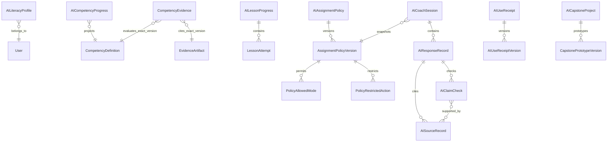

# AI Literacy Data Model ERD

```mermaid
erDiagram
  AILiteracyProfile }o--|| User : belongs_to
  AICompetencyProgress }o--|| CompetencyDefinition : projects
  CompetencyEvidence }o--|| EvidenceArtifact : cites_exact_version
  CompetencyEvidence }o--|| CompetencyDefinition : evaluates_exact_version
  AILessonProgress ||--o{ LessonAttempt : contains
  AIAssignmentPolicy ||--o{ AssignmentPolicyVersion : versions
  AssignmentPolicyVersion ||--o{ PolicyAllowedMode : permits
  AssignmentPolicyVersion ||--o{ PolicyRestrictedAction : restricts
  AICoachSession }o--|| AssignmentPolicyVersion : snapshots
  AICoachSession ||--o{ AIResponseRecord : contains
  AIResponseRecord ||--o{ AISourceRecord : cites
  AIResponseRecord ||--o{ AIClaimCheck : checks
  AIClaimCheck }o--o{ AISourceRecord : supported_by
  AIUseReceipt ||--o{ AIUseReceiptVersion : versions
  AICapstoneProject ||--o{ CapstonePrototypeVersion : prototypes
```

Every tenant-owned row carries `organizationId`; identity/version and many-to-many join records are separate. Current-version pointers are server maintained.
